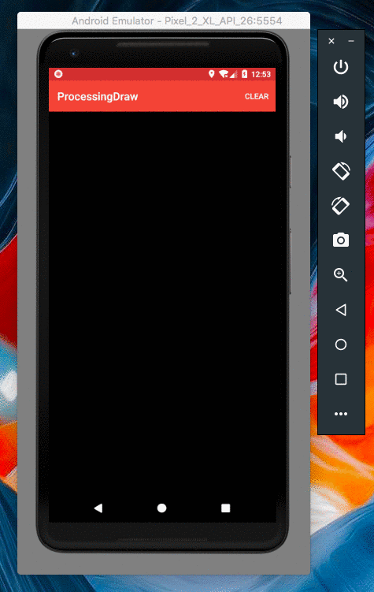
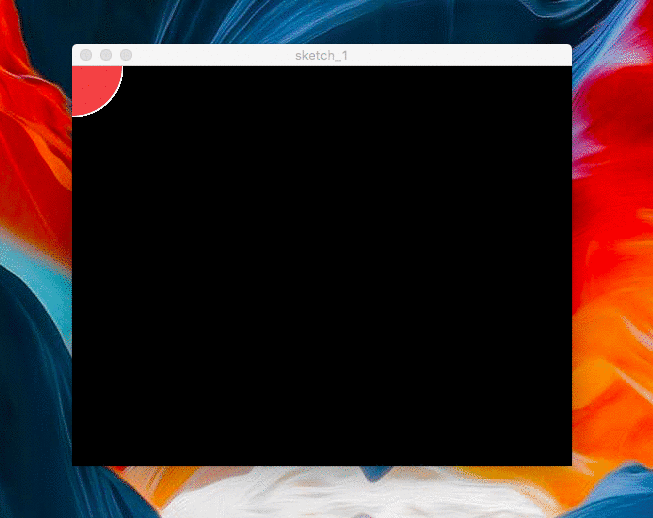
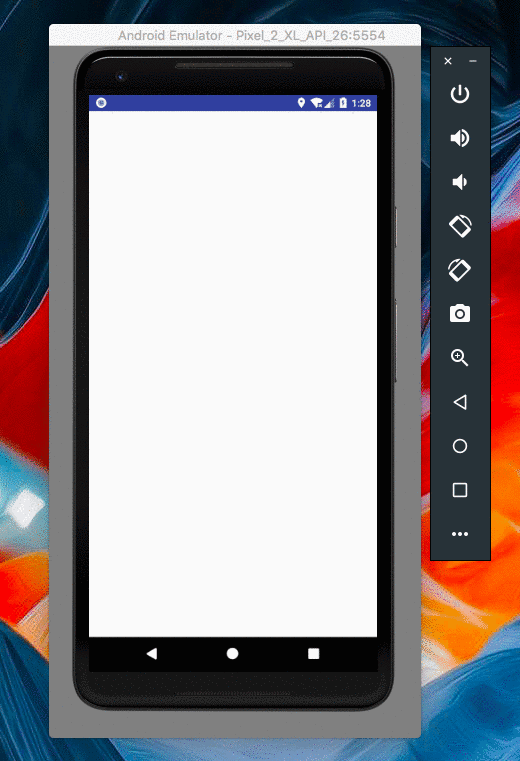

# Processing-bot

          
A Repository that showcases my sketches for Processing and Android Apps that I've built using Processing library.

## Contents
**#1 [ProcessingDraw](https://github.com/SyamSundarKirubakaran/Processing-bot/tree/master/ProcessingDraw)**
  
**#2 [Sketch_1](https://github.com/SyamSundarKirubakaran/Processing-bot/tree/master/sketch_1)**  
**#3 [Sketch_2](https://github.com/SyamSundarKirubakaran/Processing-bot/tree/master/sketch_2)**
  
**#4 [Processing3D / Catch Up](https://github.com/SyamSundarKirubakaran/Processing-bot/tree/master/Processing3D)**
  

## 1. ProcessingDraw:
An Android App that illustrates the basics of drawing content in the canvas plus provide additional attributes to switch colors while drawing in the canvas 

**You'll Learn:**
* Android Libraries
* Processing 

**Show case:**
 

  

## 2. Sketch_1:
An app that was my sketch for creating [ProcessingDraw](https://github.com/SyamSundarKirubakaran/Processing-bot/tree/master/ProcessingDraw). Used basic functionalities same as that as the Android App. 

**You'll Learn:**
* Processing 

**Show case:**
 

  

## 3. Sketch_2:
An app that was my sketch for creating [Processing3D](https://github.com/SyamSundarKirubakaran/Processing-bot/tree/master/Processing3D). Used basic functionalities same as that as the Android App. 

**You'll Learn:**
* Processing 

**Show case:**
 

  

## 4. Processing3D / Catch Up:
A 3D Android Game that uses basic Processing Libraries and JAR files for it's functionality. 

**Objective of the Game:**
* Objective is to correctly catch the object in the centre
of the screen with only one of it's side visible and the remaining sides hidden. 

**You'll Learn:**
* Android Libraries
* Processing 

**Show case:**
 
### Mock Up / Game:

  

 